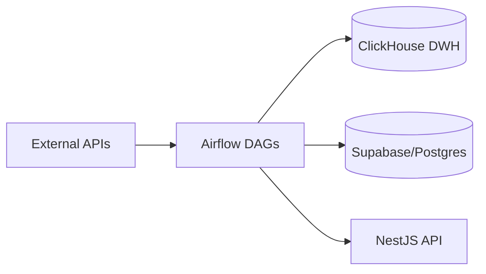

# Portfolios Tracker: Data Pipeline

The **Data Pipeline** service is the institutional-grade ETL engine of the Portfolios Tracker platform. Built with **Apache Airflow**, it handles automated data ingestion, normalization, and warehousing for multi-asset intelligence.

## 🏗️ Architecture

The pipeline follows a modular ETL/ELT architecture:

- **Orchestrator**: Apache Airflow 3.x (CeleryExecutor)
- **Data Warehouse**: ClickHouse (for historical market data and analytics)
- **Message Broker**: Redis
- **Metadata DB**: PostgreSQL
- **Key Providers**: vnstock, yfinance, CoinGecko, Supabase

### Data Flow



## 📂 Core Components

- `dags/`: Airflow directed acyclic graphs for all workflows.
- `dags/etl_modules/`: Shared logic for data fetching and notifications.
- `scripts/`: Initialization and utility scripts.
- `sql/`: DDL scripts for ClickHouse schema management.

## 🚀 Key Workflows (DAGs)

| DAG Name                      | Schedule           | Epic / Feature                             | Description                                                                    |
| :---------------------------- | :----------------- | :----------------------------------------- | :----------------------------------------------------------------------------- |
| `assets_dimension_etl`        | Weekly (Sun 2 AM)  | Epic 9.1 – Asset Dimensions                | Syncs asset master data (VN/US Stocks, Crypto, Precious Metals) to ClickHouse. |
| `market_data_evening_batch`   | Mon-Fri (6 PM ICT) | Epic 7 – EOD Market Data                   | Fetches end-of-day prices, ratios, dividends, and income statements.           |
| `refresh_adjusted_prices`     | Mon-Fri (6:30 PM)  | Epic 7 / Story 2.1                         | Rebuilds backward-adjusted OHLCV series for total-return backtests.            |
| `market_news_morning`         | Mon-Fri (7 AM ICT) | News Intelligence (Active)                 | Fetches VN stock news, stores in ClickHouse, sends AI summary to Telegram.     |
| `portfolio_schedule_snapshot` | Hourly (24/7)      | Epic 7 – Portfolio Tracking                | Triggers portfolio performance snapshots via NestJS API.                       |
| `sync_assets_to_postgres`     | Daily (3 AM)       | Epic 9.1 – Asset Sync                      | Syncs ClickHouse asset dimensions back to Supabase Postgres.                   |
| `ingest_company_intelligence` | Weekly (Sun 4 AM)  | Agentic Portfolio Creation – AI Embeddings | Ingests VN company profiles and upserts Gemini embeddings to pgvector.         |

### `market_news_morning` — Scope Decision

**Status:** ✅ **Retained** in active roadmap.

- **Product objective:** Deliver a curated, AI-powered morning news digest to users via Telegram before the VN market opens (9:15 AM ICT).
- **Success metrics:** Telegram delivery rate ≥ 99%; news freshness (last 24 h) ≥ 90% of items; Gemini summarisation latency ≤ 10 s.
- **Dependencies:** `TELEGRAM_BOT_TOKEN`, `TELEGRAM_CHAT_ID`, `GEMINI_API_KEY` in `.env`.
- **To deprecate:** Remove `fact_news` ClickHouse table references, the Telegram integration in `etl_modules/notifications.py`, and archive this DAG. Open a tracking issue before proceeding.

## 🛠️ Local Development

### Prerequisites

- Docker & Docker Compose
- `uv` (recommended for local Python environment)

### Setup

1. **Initialize Environment**:

   ```bash
   cp template.env .env
   ```

2. **Start Cluster**:

   ```bash
   docker compose up -d
   ```

3. **Access UI**:
   - Airflow Webserver: [http://localhost:8080](http://localhost:8080) (default: `airflow`/`airflow`)
   - Flower (Celery Monitor): [http://localhost:5555](http://localhost:5555)

### Running Tests

```bash
./run_tests.sh
```

## ⚙️ Configuration

Key environment variables in `.env`:

- `TELEGRAM_BOT_TOKEN` / `TELEGRAM_CHAT_ID`: For alert notifications.
- `GEMINI_API_KEY`: For AI-powered news summarization.
- `DATA_PIPELINE_API_KEY`: Internal authentication for NestJS API calls.
- `SUPABASE_URL` / `SUPABASE_SECRET_OR_SERVICE_ROLE_KEY`: Application database access.

## 🔧 Developer Scripts

> ⚠️ **These scripts are for local development and manual data recovery ONLY.** Never run them in production without explicit approval — they perform direct ClickHouse writes that can introduce duplicates or corrupt the data warehouse.

### `scripts/manual_load_data.py`

Manually triggers the full ETL cycle (prices, ratios, dividends, income statements, news) for a configurable set of tickers and date range. Intended for:

- **Backfilling** historical data after a missed scheduled run.
- **Development/debugging** of ETL transformations.
- **Initial data seeding** in a fresh local environment.

**Usage:**

```bash
# Backfill a date range
uv run python scripts/manual_load_data.py --yes-really-run --start 2024-01-01 --end 2024-01-31

# Prices only
uv run python scripts/manual_load_data.py --yes-really-run --start 2024-01-01 --end 2024-01-31 --price-only

# Refresh company dimension from vnstock
uv run python scripts/manual_load_data.py --yes-really-run --update-companies
```

**Safe usage boundaries:**

1. Run from a local machine pointing to a **non-production** ClickHouse instance or a dev replica.
2. Always pass `--yes-really-run` (script aborts without it).
3. The script will hard-abort if `CLICKHOUSE_HOST` contains `prod`, `production`, `prd`, or `live`.
4. Always run `OPTIMIZE TABLE … FINAL` afterwards (the script does this automatically) to deduplicate.
5. Do not run concurrently with a live Airflow worker processing the same tickers/date range.
6. The ticker list is hardcoded to `STOCKS = ["HPG", "VCB", "VNM", "FPT", "MWG", "VIC"]`; edit the file locally to expand it — do not commit those changes.

### `scripts/init_clickhouse_schema.py`

Creates all ClickHouse tables and databases. Run once on a fresh cluster. Idempotent (`CREATE TABLE IF NOT EXISTS`).

### `scripts/validate_dag_registry.py`

CI utility that checks that every DAG defined in `dags/*.py` is documented in this `README.md`. Run locally or in CI to catch registry drift.

```bash
uv run python scripts/validate_dag_registry.py
```
